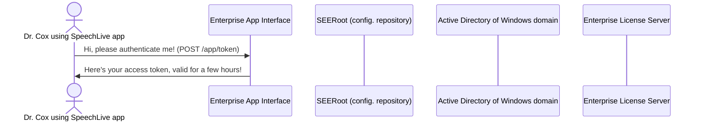

# Overview

# Authentication

Workflow for acquiring an access token:

```mermaid
sequenceDiagram
    actor U1 as Dr. Cox using SpeechLive app
    participant EAI as Enterprise App Interface
    participant SEERoot as SEERoot (config. repository)
    participant AD as Active Directory of Windows domain
    participant L as Enterprise License Server
    U1->>EAI: Hi, please authenticate me! (POST /app/token)
    EAI->>U1: Here's your access token, valid for a few hours!
```

# GET /dictation: get list of dictations
