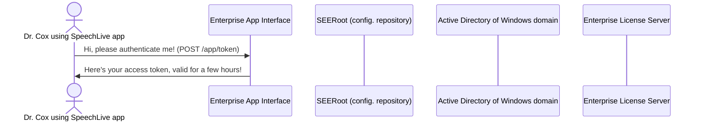

# About Mermaid diagrams
**Mermaid** provides an excellent way to include simple diagrams in your documentation. Check out the official [Mermaid help](https://mermaid-js.github.io/mermaid/#/) and show them some love!

# Mermaid diagram example
The following is the markup of Mermaid sequence diagram:
```mmd
sequenceDiagram
    actor U1 as Dr. Cox using SpeechLive app
    participant EAI as Enterprise App Interface
    participant SEERoot as SEERoot (config. repository)
    participant AD as Active Directory of Windows domain
    participant L as Enterprise License Server
    U1->>EAI: Hi, please authenticate me! (POST /app/token)
    EAI->>U1: Here's your access token, valid for a few hours!
```

And here is the rendered output:

