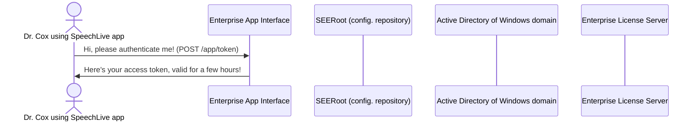

## Markdown examples

**Markdown** is a lightweight and easy-to-use syntax for styling your writing. It includes conventions for:

\```language_mode

Where:
- Three backticks start and end a syntax highlighted code block
- The optional `language_mode` string can specify the programming language for the code block. Language support [here.](https://rdmd.readme.io/docs/code-blocks#language-support)

\# Header 1

\## Header 2

\### Header 3

\- Bulleted

\- List

\1. Numbered

\2. List

\**Bold** and \_Italic_ and \`Code` text

\[Link](url) and \![Image]\(src)

\```

### Rendered output of a C# block:
```csharp
// Simple C# program to illustrate identifiers
using System;
 
class Summer {
 
    // Main Method, the starting point of our program
    static public void Main()
    {
 
        // local variables
        uint a = 10;
        uint b = 3;
        ulong summa;
 
        // simple addition
        summa = a + b;
        Console.WriteLine($"The sum of {a} and {b} is: {summa}");
    }
}
```

### Rendered output of a Markdown block:

```markdown
Syntax highlighted code block

# Header 1
## Header 2
### Header 3

- Bulleted
- List

1. Numbered
2. List

**Bold** and _Italic_ and `Code` text

[Link](url) and 
```

For more details see [Basic writing and formatting syntax](https://docs.github.com/en/github/writing-on-github/getting-started-with-writing-and-formatting-on-github/basic-writing-and-formatting-syntax).

## Mermaid diagram example
**Mermaid** provides an excellent way to include simple diagrams in your documentation. Check out the official [Mermaid help](https://mermaid-js.github.io/mermaid/#/) and show them some love!


The following is the markup of Mermaid sequence diagram:
```
sequenceDiagram
    actor U1 as Dr. Cox using SpeechLive app
    participant EAI as Enterprise App Interface
    participant SEERoot as SEERoot (config. repository)
    participant AD as Active Directory of Windows domain
    participant L as Enterprise License Server
    U1->>EAI: Hi, please authenticate me! (POST /app/token)
    EAI->>U1: Here's your access token, valid for a few hours!
```

And here is the rendered output:

