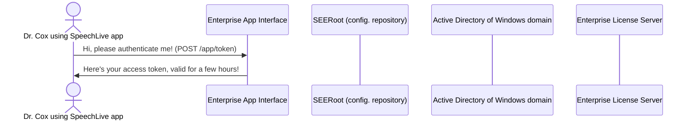

### Markdown examples

Markdown is a lightweight and easy-to-use syntax for styling your writing. It includes conventions for

```markdown
Syntax highlighted code block

# Header 1
## Header 2
### Header 3

- Bulleted
- List

1. Numbered
2. List

**Bold** and _Italic_ and `Code` text

[Link](url) and 
```

For more details see [Basic writing and formatting syntax](https://docs.github.com/en/github/writing-on-github/getting-started-with-writing-and-formatting-on-github/basic-writing-and-formatting-syntax).

### Mermaid diagram example
Mermaid provide an excellent way to include simple diagrams in your documentation. Check out the official [Mermaid help](https://mermaid-js.github.io/mermaid/#/) and show them some love!


The following is a Mermaid sequence diagram:

